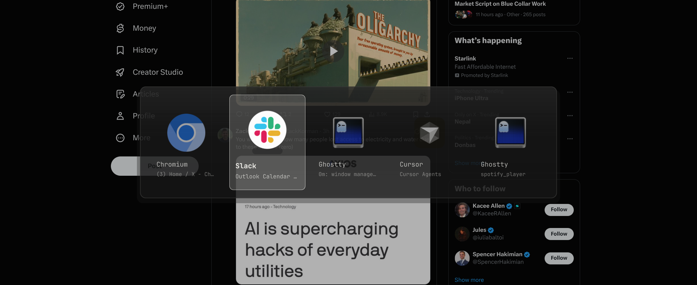

# Omarchy Alt-Tab

A themed, translucent macOS-style window switcher for Omarchy. It cycles only through switchable windows on the active workspace of the focused monitor, ordered by Hyprland focus history.



## Install

```bash
omarchy plugin add https://github.com/rmacy/omarchy-alt-tab --enable
```

Manage the installed plugin with Omarchy:

```bash
omarchy plugin update bitr0t.window-switcher
omarchy plugin disable bitr0t.window-switcher
omarchy plugin enable bitr0t.window-switcher
omarchy plugin remove bitr0t.window-switcher
```

Disabling or removing the plugin reloads Hyprland so the configured Alt-Tab bindings are restored.

## Controls

| Input | Action |
| --- | --- |
| `Alt+Tab` | Open and select the next window |
| `Alt+Shift+Tab` | Open and select the previous window |
| `Tab` / `Right` | Advance while the switcher is open |
| `Shift+Tab` / `Left` | Move backward |
| `Enter` | Focus and raise the selection |
| `Escape` | Cancel |
| Release `Alt` | Focus and raise the selection |
| Click a card | Focus and raise that window |

A single window uses a compact horizontal card. An empty workspace shows a compact zero state until Alt is released.

## Scope and behavior

- Only the **active workspace on the focused monitor** is included.
- Hidden, unmapped, non-input, other-workspace, and other-monitor clients are excluded.
- At most 256 MRU candidates are presented.
- The selected client is revalidated by Hyprland stable ID before focus.
- Application colors, borders, fonts, spacing, and opacity derive from Omarchy `Color` and `Style` theme tokens and update with the active theme.
- Client-controlled titles are rendered as plain text. Class-based fallback icons accept theme-icon identifiers only; paths and URLs are rejected.
- Client shortcut inhibitors are respected. Alt-Tab remains inside a VM, remote desktop, game, or other client while that client owns shortcuts.

## Capability disclosure

Omarchy shell plugins are unsandboxed. This plugin loads a persistent `service` plus an `overlay` inside `omarchy-shell`.

The service:

- Intentionally replaces the configured `Alt+Tab` and `Alt+Shift+Tab` chords while enabled.
- Registers owner-guarded Hyprland Lua callbacks and a temporary `bitr0t-window-switcher` submap through `hyprctl eval`.
- Uses bounded Alt-state polling while a switch is active and coalesces rapid navigation.
- Invokes fixed `omarchy-shell` IPC methods (`advance`, `commit`, and `cancel`).
- Runs `hyprctl reload` during orderly teardown to restore configured bindings.
- Uses `notify-send` only if binding registration fails after bounded retries.

The overlay reads Quickshell's native Hyprland toplevel model. It performs no network requests, privileged commands, package installation, or filesystem writes.

Runtime commands: `hyprctl`, `omarchy-shell`, `sh` during teardown, and optional failure-path `notify-send`.

## Requirements

- Omarchy with the Quickshell shell plugin host
- Hyprland with Omarchy's Lua configuration API (tested with Hyprland 0.56.2)
- Quickshell 0.3 or newer
- `notify-send` for persistent registration-failure notification

No build step, downloaded artifact, native binary, Node package, Python package, or runtime setup is required.

## Recovery

If a compositor or shell crash interrupts a switch:

```bash
hyprctl dispatch 'hl.dsp.submap("reset")'
hyprctl reload
omarchy restart shell
```

Inspect configuration errors with:

```bash
hyprctl configerrors
```

## Development and verification

Repository tasks use [mise](https://mise.jdx.dev/):

```bash
mise run check
```

`check` runs the pure model and generated-Lua tests, QML diagnostics, the production Quickshell construction smoke, and manifest validation. A separate live Hyprland smoke exercises real press/repeat/reverse/release, focus-and-raise, reload recovery, theme mutation, and zero/single/many states.

## License

[MIT](LICENSE) — Copyright © 2026 Ryan Macy.
